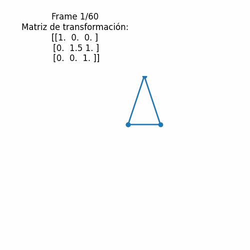
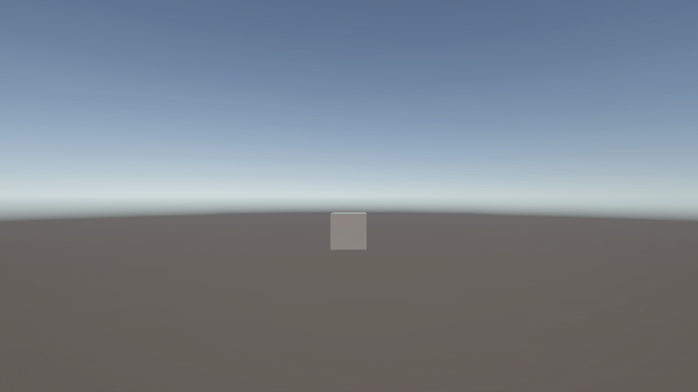
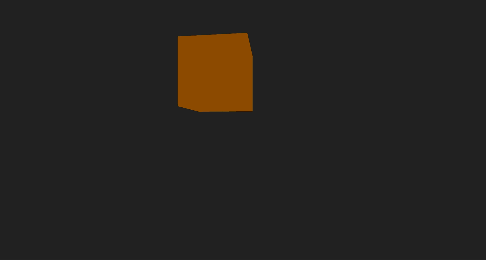
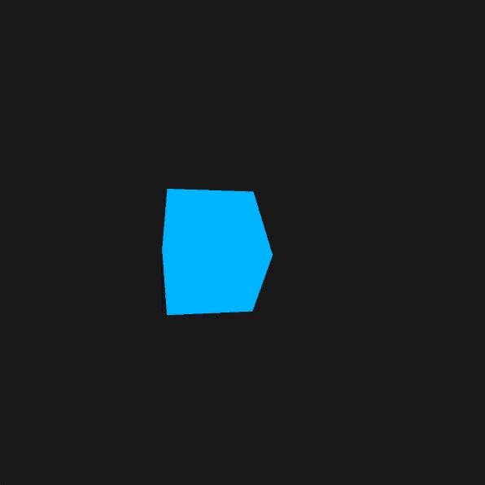

# Taller 0 - Transformaciones 2D y 3D con Animaciones
# Samuel Reyes Benavides
# Computación Visual - 2025-II

Este taller muestra **transformaciones geométricas** (traslación, rotación, escala) animadas en diferentes entornos: **Python (Colab/Jupyter), Unity, Three.js + React Three Fiber, y Processing**. Para cada implementación se incluye una breve explicación, el código relevante o enlace al entorno, y **GIFs/capturas** para mostrar las animaciones.

---

## 1. Python (Colab/Jupyter Notebook)

### Explicación
Se implementa una figura 2D (un triángulo) que se transforma usando matrices homogéneas para traslación, rotación y escala, y se anima en función del tiempo. El resultado se exporta como un GIF animado. El código está completamente comentado para facilitar su entendimiento.

### GIF
> 

### Código
```python
import numpy as np
import matplotlib.pyplot as plt
import imageio
import io

# Número de frames que tendrá la animación
n_frames = 60

# Definición del triángulo (figura inicial) usando coordenadas 2D
triangle = np.array([
    [0, 0],      # Punto 1
    [1, 0],      # Punto 2
    [0.5, 1],    # Punto 3
    [0, 0]       # Para cerrar el triángulo
])

# Función para crear la matriz de traslación
def get_translation_matrix(tx, ty):
    """
    Devuelve la matriz de traslación 3x3 para mover puntos tx unidades en X y ty en Y.
    """
    return np.array([
        [1, 0, tx],
        [0, 1, ty],
        [0, 0, 1]
    ])

# Función para crear la matriz de rotación
def get_rotation_matrix(theta):
    """
    Devuelve la matriz de rotación 3x3 para rotar theta radianes.
    """
    c, s = np.cos(theta), np.sin(theta)
    return np.array([
        [c, -s, 0],
        [s,  c, 0],
        [0,  0, 1]
    ])

# Función para crear la matriz de escala
def get_scale_matrix(sx, sy):
    """
    Devuelve la matriz de escala 3x3 para escalar sx veces en X y sy veces en Y.
    """
    return np.array([
        [sx, 0, 0],
        [0, sy, 0],
        [0,  0, 1]
    ])

# Función para aplicar la matriz de transformación a los puntos
def apply_transform(points, M):
    """
    Aplica la matriz M (3x3) a los puntos 2D dados.
    Convierte los puntos a coordenadas homogéneas, realiza la multiplicación y retorna los puntos transformados.
    """
    ones = np.ones((points.shape[0], 1))           # Agrega columna de unos para homogéneos
    pts_hom = np.hstack([points, ones])            # Convierte a 3D homogéneo
    pts_trans = (M @ pts_hom.T).T                  # Aplica transformación
    return pts_trans[:, :2]                        # Retorna coordenadas 2D

# Lista para almacenar los frames de la animación
frames = []

# Bucle principal para generar cada frame de la animación
for i in range(n_frames):
    # Normaliza el tiempo t entre 0 y 1
    t = i / (n_frames - 1)
    
    # Calcula los parámetros de transformación que varían con el tiempo
    tx = 2 * np.sin(2 * np.pi * t)          # Traslación en X
    ty = 1 * np.cos(2 * np.pi * t)          # Traslación en Y
    theta = 2 * np.pi * t                   # Rotación en radianes (0 a 360 grados)
    sx = 1 + 0.5 * np.sin(2 * np.pi * t)    # Escala en X
    sy = 1 + 0.5 * np.cos(2 * np.pi * t)    # Escala en Y

    # Construye las matrices de transformación
    T = get_translation_matrix(tx, ty)
    R = get_rotation_matrix(theta)
    S = get_scale_matrix(sx, sy)
    
    # Matriz total: primero escala, luego rota, luego traslada
    M = T @ R @ S

    # Aplica la transformación al triángulo
    triangle_t = apply_transform(triangle, M)
    
    # Crea la figura y ajusta la posición del área de gráfico para dejar espacio arriba
    fig, ax = plt.subplots(figsize=(5, 5))
    plt.subplots_adjust(top=0.7)  # Ajusta el margen superior para el texto

    # Dibuja el triángulo transformado
    ax.plot(triangle_t[:, 0], triangle_t[:, 1], 'o-', lw=2)
    ax.set_xlim(-3, 3)             # Limites ejes X
    ax.set_ylim(-2, 2.5)           # Limites ejes Y
    ax.set_aspect('equal')         # Mantiene proporciones
    ax.axis('off')                 # Oculta ejes

    # Escribe la matriz de transformación arriba a la izquierda, fuera del área del triángulo
    fig.text(
        0.3, 0.95, 
        f'Frame {i+1}/{n_frames}\nMatriz de transformación:\n{np.round(M, 2)}',
        ha='center', va='top', fontsize=12,
        bbox=dict(facecolor='white', alpha=0.8, edgecolor='none')
    )
    
    # Guarda el frame en un buffer de memoria y lo lee como imagen
    buf = io.BytesIO()
    plt.savefig(buf, format='png')
    buf.seek(0)
    frame = imageio.imread(buf)
    frames.append(frame)
    plt.close(fig)
    buf.close()

# Exporta todos los frames como un GIF animado
imageio.mimsave('animated_transform.gif', frames, duration=0.05)
print("¡Animación exportada como 'animated_transform.gif'!")

# Muestra el GIF directamente en Jupyter o Colab
from IPython.display import Image
Image(filename='animated_transform.gif')
```

---

## 2. Unity

### Explicación
En Unity, la animación implementa traslación aleatoria del objeto en los ejes X o Y cada ciertos segundos, rotación continua sobre el eje Y y un escalado oscilante basado en una función seno, todo controlado por el script TransformController. Luego se añadio el script al GameObject y ajustar los parámetros desde el Inspector para visualizar las transformaciones.

### GIF
> 

### Código
```csharp
using UnityEngine;

/// Controla la traslación aleatoria, rotación constante y escalado oscilante de un objeto en Unity.
/// 
/// - Traslación: mueve el objeto en los ejes X o Y cada ciertos segundos de forma aleatoria.
/// - Rotación: rota el objeto constantemente sobre el eje Y.
/// - Escalado: oscila el tamaño del objeto usando una función seno.
/// 
/// Requisitos de uso:
/// 1. Añade este script a un GameObject (por ejemplo, un Cubo o Esfera).
/// 2. Ajusta los parámetros desde el Inspector si lo deseas.

public class TransformController : MonoBehaviour
{
    // --- Traslación aleatoria ---

    // Intervalo de tiempo (segundos) entre cada movimiento aleatorio
    public float translationInterval = 2.0f;
    // Distancia que se moverá el objeto por cada traslación
    public float translationDistance = 1.0f;
    // Temporizador interno para controlar el intervalo de traslación
    private float translationTimer = 0f;

    // --- Rotación constante ---

    // Velocidad de rotación en grados por segundo
    public float rotationSpeed = 90f;

    // --- Escalado oscilante ---

    // Amplitud máxima de la oscilación de escala
    public float scaleAmplitude = 0.5f;
    // Frecuencia de la oscilación (ciclos por segundo)
    public float scaleFrequency = 2f;

    /// <summary>
    /// Se ejecuta una vez por frame. Gestiona traslación, rotación y escalado.
    /// </summary>
    void Update()
    {
        // ----- Traslación aleatoria por X o Y cada ciertos segundos -----
        translationTimer += Time.deltaTime; // Actualiza el temporizador con el tiempo transcurrido
        if (translationTimer >= translationInterval)
        {
            translationTimer = 0f; // Reinicia el temporizador

            // Elije aleatoriamente el eje (0 = X, 1 = Y)
            int axis = Random.Range(0, 2);
            Vector3 translation = Vector3.zero;

            // Determina la dirección aleatoria (+ o -) en el eje seleccionado
            if (axis == 0)
                translation.x = translationDistance * (Random.value > 0.5f ? 1 : -1);
            else
                translation.y = translationDistance * (Random.value > 0.5f ? 1 : -1);

            // Aplica la traslación en espacio global
            transform.Translate(translation, Space.World);
        }

        // ----- Rotación constante dependiente de Time.deltaTime -----
        // Rota el objeto sobre el eje Y a la velocidad indicada
        transform.Rotate(Vector3.up, rotationSpeed * Time.deltaTime);

        // ----- Escalado oscilante en función de Mathf.Sin(Time.time) -----
        // Calcula la escala usando una onda sinusoidal para oscilar el tamaño
        float scale = 1 + Mathf.Sin(Time.time * scaleFrequency) * scaleAmplitude;
        // Aplica el mismo valor de escala en X, Y y Z (uniforme)
        transform.localScale = new Vector3(scale, scale, scale);
    }
}
```
---

## 3. Three.js + React Three Fiber

### Explicación
En Three.js con React Three Fiber, se anima un cubo que se traslada en una trayectoria circular en los ejes X e Y, rota constantemente sobre el eje Y y oscila su escala suavemente en el tiempo. La escena se controla con el mouse y el cubo es iluminado por luces ambientales y puntuales.

### GIF
> 

### Código
```javascript
// Importamos los módulos principales de React Three Fiber y Drei.
// Canvas: Renderiza la escena 3D.
// useFrame: Hook para animaciones por frame.
// OrbitControls: Permite controlar la cámara con el mouse.
// useRef: Referencia mutable para manipular el mesh directamente.
import { Canvas, useFrame } from '@react-three/fiber';
import { OrbitControls } from '@react-three/drei';
import { useRef } from 'react';

// Estilos para que el Canvas ocupe toda la pantalla, fijado al viewport.
const styles = {
  width: '100vw',
  height: '100vh',
  position: 'fixed',
  top: 0,
  left: 0,
};

/**
 * AnimatedCube
 * Componente que renderiza un cubo animado.
 * - Se mueve en una trayectoria circular (coseno/seno).
 * - Rota sobre su eje Y constantemente.
 * - Su escala varía suavemente en el tiempo.
 */
function AnimatedCube() {
  // Referencia al mesh para modificar sus propiedades directamente.
  const meshRef = useRef();

  /**
   * Animación ejecutada en cada frame.
   * - 'clock.getElapsedTime()' proporciona el tiempo transcurrido.
   * - Se actualizan posición, rotación y escala del cubo.
   */
  useFrame(({ clock }) => {
    const t = clock.getElapsedTime();
    // Movimiento circular en X e Y.
    meshRef.current.position.x = Math.cos(t) * 2;
    meshRef.current.position.y = Math.sin(t) * 2;
    // Rotación continua sobre el eje Y.
    meshRef.current.rotation.y += 0.03;
    // Escalado suave usando función seno.
    const scale = 1 + Math.sin(t) * 0.5;
    meshRef.current.scale.set(scale, scale, scale);
  });

  return (
    <mesh ref={meshRef}>
      {/* Geometría del cubo, tamaño 1.5 en cada eje */}
      <boxGeometry args={[1.5, 1.5, 1.5]} />
      {/* Material estándar de color naranja */}
      <meshStandardMaterial color="orange" />
    </mesh>
  );
}

/**
 * App
 * Componente principal de la aplicación.
 * - Renderiza el Canvas 3D ocupando toda la pantalla.
 * - Configura la cámara y las luces.
 * - Añade el cubo animado y los controles de órbita.
 */
export default function App() {
  return (
    <div style={styles}>
      <Canvas
        // Configuración de la cámara: alejada para ver el cubo completo.
        camera={{ position: [0, 0, 8], near: 0.1, far: 1000, fov: 60 }}
      >
        {/* Luz ambiental para iluminar toda la escena */}
        <ambientLight intensity={0.7} />
        {/* Luz puntual para resaltar el cubo */}
        <pointLight position={[10, 10, 10]} />
        {/* Cubo animado */}
        <AnimatedCube />
        {/* OrbitControls permite mover la cámara con el mouse */}
        <OrbitControls
          enablePan={true}         // Permite mover la cámara lateralmente
          enableZoom={true}        // Permite acercar/alejar la vista
          minDistance={4}          // Distancia mínima al objeto
          maxDistance={15}         // Distancia máxima al objeto
          maxPolarAngle={Math.PI}  // Limita el ángulo vertical de la cámara
        />
      </Canvas>
    </div>
  );
}
```
---

## 4. Processing

### Explicación
En Processing se anima un cubo 3D que se mueve en una trayectoria ondulada, rota sobre los ejes X e Y y varía su escala en el tiempo mediante funciones seno y coseno. El efecto combina traslación, rotación y escalado para mostrar transformaciones geométricas en tiempo real dentro de un entorno 3D.

### GIF
> 

### Código
```java
// Cubo animado en 3D con transformaciones y animación temporal

void setup() {
  size(600, 600, P3D); // Ventana 3D de 600x600
  noStroke();          // Sin bordes en el cubo
}

void draw() {
  background(30); // Fondo oscuro

  // Centrar el sistema de coordenadas en el centro de la ventana
  translate(width/2, height/2, 0);

  // t: tiempo en segundos usando millis()
  float t = millis() * 0.002;

  // Animación de escala (varía cíclicamente)
  float escala = 1.2 + sin(t) * 0.5;

  // Animación de traslación (movimiento ondulado)
  float x = sin(t) * 150;
  float y = cos(t * 0.5) * 80;

  // Animación de rotación
  float rotY = t;
  float rotX = t * 0.7;

  // Aíslamos las transformaciones para el cubo
  pushMatrix();

  translate(x, y, 0); // Mueve el cubo de forma ondulada
  rotateY(rotY);      // Rota sobre eje Y
  rotateX(rotX);      // Rota sobre eje X
  scale(escala);      // Escala el cubo

  fill(0, 180, 255);  // Color azul claro
  box(100);           // Dibuja el cubo

  popMatrix(); // Restauramos el sistema de coordenadas
}
```
---