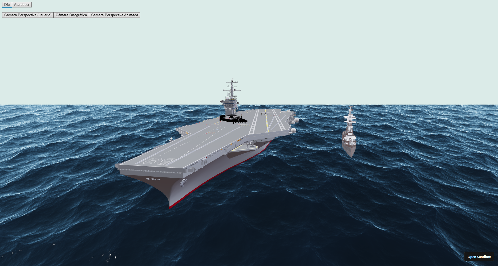
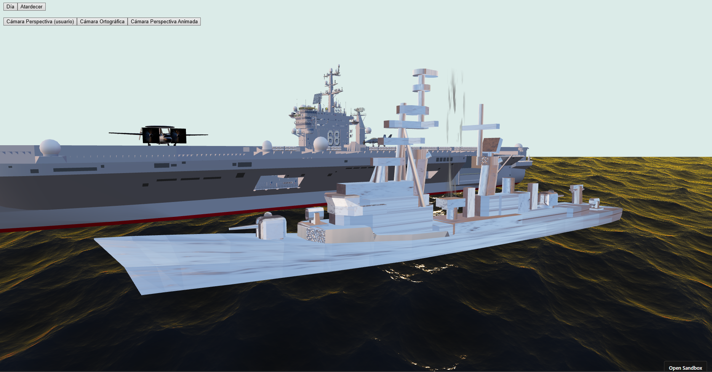
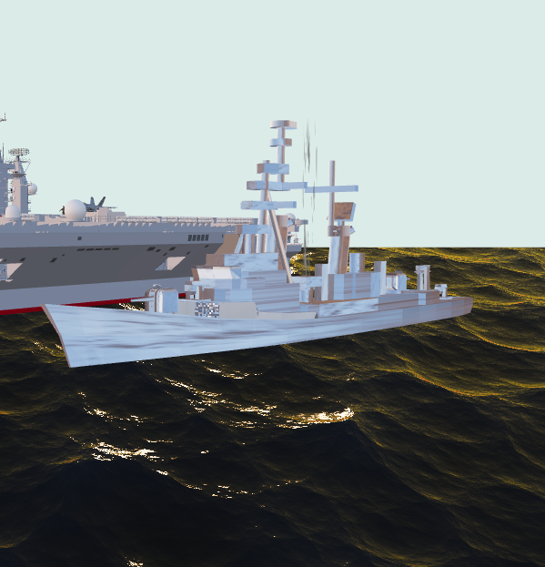

# Computación Visual - Taller 1 - Mundo 3D

## Samuel Reyes Benavides

## 🌎 Breve explicación del mundo creado

Este proyecto presenta una escena 3D interactiva inspirada en un entorno naval contemporáneo, donde un portaviones, un destructor, dos aviones y un piloto componen un micro-mundo tecnológico y realista. El objetivo es explorar materiales PBR, iluminación avanzada, shaders procedurales y cámaras dinámicas, resaltando los contrastes y la percepción visual bajo diferentes condiciones de luz.

---

## 🛩️ Modelos GLB usados

| Nombre                       | Fuente                                | Modificaciones (escala, rotación, materiales)         |
|------------------------------|---------------------------------------|-------------------------------------------------------|
| Portaviones USS Nimitz (CVN-68)         | Sketchfab               | Escala 0.05, rotación default, materiales estándar    |
| Destructor Clase Arleigh Burke (FGS Mölders)     | Sketchfab               | Escala 100, rotación Y, materiales PBR personalizados |
| Avión F/A-18E/F Super Hornet            | Sketchfab               | Escala 0.2, rotación Y, materiales estándar           |
| Avión Grumman E2D Hawkeye            | Sketchfab               | Escala 2.5, rotación Y, PBR con texturas personalizadas|
| Piloto                       | Sketchfab               | Escala 300, rotación Y, materiales estándar           |

---

## 💡 Iluminación

La escena utiliza un **esquema de iluminación cinematográfica** adaptado al contexto naval, con cuatro fuentes principales:

- **Key Light (Direccional):**
  - Simula el sol o la fuente principal de luz.
  - Anima su posición, color e intensidad según el preset (día: blanca y alta, atardecer: baja y cálida).
  - Proyecta sombras de alta resolución, especialmente para la pista de aterrizaje y los aviones/piloto.

- **Fill Light (Direccional):**
  - Luz secundaria, color frío (azulado), rellena sombras.
  - Animada para variar intensidad y posición, suavizando el modelado facial y lateral de los modelos.

- **Rim Light (Direccional):**
  - Luz de contraluz, separa los objetos del fondo.
  - Posición y color animados para dar volumen y resaltar bordes de los modelos.

- **Ambient Light & HDRI Environment:**
  - Luz ambiental modulada, aporta iluminación indirecta y “baño” de color del entorno.
  - El HDRI cambia según preset (día/atardecer) para aportar color global y reflejos.

**Presets:**
- **Día:** Key blanca, fill y rim azuladas, sombras duras y fuertes.
- **Atardecer:** Key naranja-dorada, fill más suave, rim cálida, sombras más largas y difusas.

**Justificación:**  
La iluminación se diseñó para enfatizar la volumetría de los modelos, resaltar materiales PBR y crear ambientes perceptualmente distintos. El movimiento de luces refuerza la sensación del paso del tiempo y la interacción con los shaders procedurales del mar y el humo.

---

## 🧪 Materiales y texturas (PBR)

En la escena, varios objetos utilizan materiales **PBR (Physically Based Rendering)** cuidadosamente parametrizados para lograr un realismo acorde al entorno naval:

- **Destructor Clase Arleigh Burke**
  - **Material:** `MeshStandardMaterial` con mapas de color, metalness, roughness, normal y displacement.
  - **Roughness:** 0.6–1.0 (superficies metálicas envejecidas, no brillantes).
  - **Metalness:** 0.18–1.0 (zonas metálicas y detalles reflectivos).
  - **Normal Map:** Escala (1,1) para simular remaches, placas y detalles de casco.
  - **Displacement Map:** 0.12–0.15 para resaltar geometría en la cubierta y detalles del casco.
  - **Justificación:** Permite que la superficie del barco reaccione fielmente a la dirección e intensidad de la luz, resaltando imperfecciones y geometría.

- **Avión Grumman E2D Hawkeye**
  - **Material:** `MeshStandardMaterial` con todas las texturas PBR.
  - **Roughness:** 0.7–0.95 (acabado mate, propio de aeronaves militares).
  - **Metalness:** 0.3–0.9 (partes metálicas y detalles reflectivos).
  - **Normal Map:** Detalles de paneles, remaches y líneas.
  - **Displacement Map:** 0.12 para realce sutil de geometría.
  - **Justificación:** Proporciona el contraste adecuado entre partes metálicas y pintadas, y permite ver la interacción con la luz durante las animaciones.

---

## 🖌️ Shaders procedurales

**Mar (`SeaShaderMaterial`):**
- **Tipo:** Ruido y ondas paramétricas.
- **Parámetros:** Dirección y color del sol, velocidad del oleaje, amplitud de ondas.
- **Aplicación:** Asignado al plano del mar bajo toda la escena.
- **Justificación:** Otorga realismo y dinamismo al entorno, con reflejos y movimiento continuo que reaccionan al preset de iluminación.

**Humo (`SmokeColumnShaderMaterial`):**
- **Tipo:** Ruido fractal + bandas verticales (máscara de columna).
- **Parámetros:** Velocidad de ascenso, densidad, suavizado de bordes, animación cíclica.
- **Aplicación:** Plano vertical sobre el barco pequeño o zona de incendio.
- **Justificación:** Permite simular una columna de humo animada, sin texturas externas, y con opacidad variable según densidad y borde.

---

## 🎥 Cámaras

- **Perspectiva (usuario):**
  - Controlada con OrbitControls, permite exploración libre.
  - **Intención:** Dar la experiencia más inmersiva y realista, permitiendo al usuario observar materiales y efectos desde cualquier ángulo.
- **Ortográfica:**
  - Vista sin distorsión de perspectiva, ideal para inspecciones técnicas y composición.
  - **Intención:** Permitir análisis de proporciones y relaciones espaciales en la escena, útil para contrastar con la cámara perspectiva.
- **Perspectiva Animada:**
  - Gira suavemente alrededor de la escena central.
  - **Intención:** Mostrar la interacción de materiales, sombras y luces en todo el entorno, facilitando la observación de animaciones globales sin interacción manual.

**Justificación:**  
La alternancia de cámaras permite comparar cómo los materiales y la iluminación afectan la percepción espacial y visual de la escena, enriqueciendo la experiencia educativa y técnica.

---

## 🌀 Animaciones

- **Cámara:**  
  - Vista animada con movimiento orbital automático.
  - Alternancia manual entre modos de cámara.
- **Luces:**  
  - Key, fill y rim animan su posición, color e intensidad para simular el paso del tiempo y cambios de atmósfera.
- **Shaders:**  
  - Mar y humo animados proceduralmente mediante `useFrame`, independientes del movimiento de la cámara.

**Justificación de cámaras y animaciones:**  
Las animaciones no solo aportan realismo, sino que permiten estudiar los efectos dinámicos de la luz sobre los materiales PBR y los shaders procedurales, mostrando cómo cambian las sombras, reflejos y la percepción de profundidad al variar el punto de vista y la luz.

---

## 🎨 Paleta de color (RGB/HSV/CIELAB)

| Elemento         | RGB        | HSV              | CIELAB* (aprox)      | Justificación perceptual         |
|------------------|------------|------------------|----------------------|----------------------------------|
| Mar              | 25,56,95   | 211,74%,37%      | 26, -2, -27          | Máximo contraste con barcos/humo |
| Barcos/Metales   | 180,180,185| 225,3%,72%       | 75, 0, -2            | Diferenciación clara en luz      |
| Humo             | 38,38,38   | 0,0%,15%         | 16, 0, 0             | Contraste con cielo y mar        |
| Key Día          | 255,255,255| 0,0%,100%        | 100, 0, 0            | Iluminación neutra               |
| Key Tarde        | 255,215,120| 42,53%,100%      | 90, 4, 50            | Luz cálida, atmósfera            |

**Justificación:**  
Esta paleta asegura contrastes perceptuales altos entre los elementos principales, maximizando la legibilidad en ambos presets de iluminación ― según CIELAB, la diferencia ΔE entre mar y humo o barcos es perceptible y adecuada para tareas visuales y realismo.

---

## 🖼️ Capturas de pantalla obligatorias

> **Coloca aquí tus capturas en una carpeta `captures/` y enlázalas así:**
>
> - 
> - 
> - 
> - 

---

## 🎞️ GIFs animados / video corto obligatorios

> - **Cambio de materiales bajo distinta luz:**  
>   
>
> - **Alternancia entre cámara perspectiva y ortográfica:**  
>   
>
> - **Movimiento de luces y objetos con shaders procedurales activos:**  
>   

---
